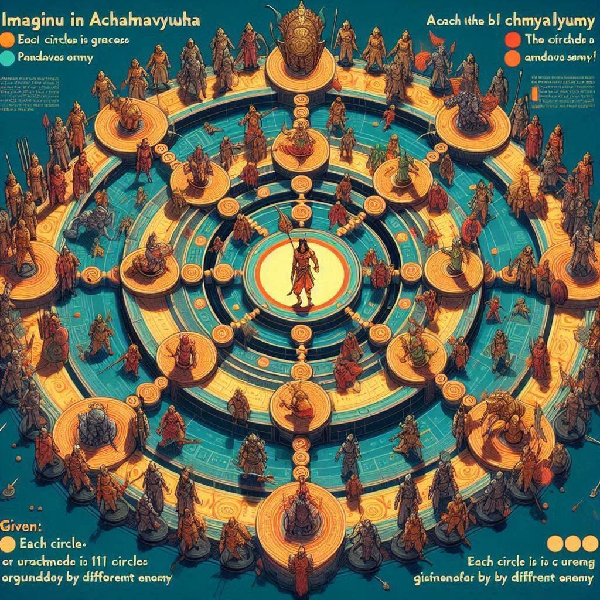

<!-- Improved compatibility of back to top link: See: https://github.com/othneildrew/Best-README-Template/pull/73 -->
<a name="readme-top"></a>
<!--
*** Thanks for checking out the Best-README-Template. If you have a suggestion
*** that would make this better, please fork the repo and create a pull request
*** or simply open an issue with the tag "enhancement".
*** Don't forget to give the project a star!
*** Thanks again! Now go create something AMAZING! :D
-->


<!-- PROJECT LOGO -->
<br />
<div align="center">
    
  <h3 align="center">Abhimanyu and the Chakravyuha</h3>

  <p align="center">
    My Approach and proposed algorithm to the problem
  </p>
</div>


<!-- TABLE OF CONTENTS -->
<details>
  <summary>Table of Contents</summary>
  <ol>
    <li>
      <a href="#introduction-to-problem">Introduction to Problem</a>
    </li>
    <li>
        <a href="#problem-analysis-and-simplification">Problem Analysis and Simplification</a>
        <ul>
            <li><a href="#simplifying-problem-statement">Simplifying Problem Statement</a></li>
            <li><a href="#assumptions">Assumptions</a></li>
            <li><a href="#final-problem-statement">Final Problem Statement</a></li>
        </ul>
    </li>
    <li><a href="#designing-algorithm">Designing Algorithm</a></li>
    <li>
        <a href="#implementation">Implementation</a>
        <ul>
            <li><a href="#pseudocode">Pseudocode</a></li>
            <li><a href="#python-code">Python Code</a></li>
            <li><a href="#c++-code">C++ Code</a></li>
            <li><a href="#javascript-code">Javascript Code</a></li>
            <li><a href="#executable">Executable</a></li>
        </ul>
    </li>
    <li>
        <a href="#algorithm-analysis">Algorithm Analysis</a>
        <ul>
            <li><a href="#time-complexity">Time Complexity</a></li>
            <li><a href="#space-complexity">Space Complexity</a></li>
            <li><a href="#summary">Summary</a></li>
        </ul>
    </li>
    <li><a href ="#contact-and-acknowledgement">Contact and Acknowledgement</a></li>
  </ol>
</details>


<!-- Introduction to Problem -->
## Introduction to Problem
Imagine Abhimanyu in Chakravyuha. There are 11 circles in the Chakravyuha surrounded by different enemies. Abhimanyu is located in the innermost circle and has to cross all the 11 circles to reach Pandavas army back

Images will go here

<ul>
  <li>Each circle is guarded by different enemy where enemy is equipped with k1, k2……k11 powers Abhmanyu start from the innermost circle with p power Abhimanyu has a boon to skip fighting enemy a times </li>
  <li>Abhmanyu can recharge himself with power b times </li>
  <li>Battling in each circle will result in loss of the same power from Abhimanyu as the enemy. </li>
  <li>If Abhmanyu enter the circle with energy less than the respective enemy, he will lose the battle</li>
  <li>k3 and k7 enemies are endured with power to regenerate themselves once with half of their initial power and can attack Abhimanyu from behind if he is battling in iteratively next circle </li>
</ul>  
<p align="right">(<a href="#readme-top">back to top</a>)</p>


## Problem Analysis and Simplification

### Simplifying Problem Statement
<ul>
  <li>Abhimanyu needs to cross 11 circles, each guarded by an enemy.</li>
  <li>Each enemy has a power value k1, k2, ..., k11.</li>
  <li>Abhimanyu starts with a certain power p.</li>
  <li>Abhimanyu can skip fighting a times.</li>
  <li>Abhimanyu can recharge his power to the original value b times.</li>
  <li>Battling an enemy reduces Abhimanyu's power by the enemy's power.</li>
  <li>If Abhimanyu's power is less than the enemy's power and he can't skip or recharge, he loses.</li>
</ul>

### Assumptions
<ol>
  <li>Meaning of word <strong>Recharge</strong> <br/> During the design of this algorithm, the term "Recharge" is defined as restoring Abhimanyu's power to its original level, regardless of his current power state.<br/>Recharging Abhimanyu when his power is already at its initial level is unnecessary.</li>
  <li>The enemies in circles k3 and k7 deploy their optimal power strategically. If Abhimanyu defeats the enemies in these circles, they will regenerate with half of their initial power and can attack Abhimanyu from behind. Conversely, if Abhimanyu skips the k3 and k7 circles using his boon, these enemies will attack him from behind with their full initial power.</li>
</ol>

### Final Problem Statement
<ul>
  <li>Abhimanyu needs to cross 11 circles, each guarded by an enemy.</li>
  <li>Each enemy has a power value k1, k2, ..., k11. enemy circles k4 and k8 get additional power of k3 or k3/2 and k7 or k7/2 respectively based on the situation</li>
  <li>Abhimanyu starts with a certain power p.</li>
  <li>Abhimanyu can skip fighting a times.</li>
  <li>Abhimanyu can recharge his power to the original value b times.</li>
  <li>Battling an enemy reduces Abhimanyu's power by the enemy's power.</li>
  <li>If Abhimanyu's power is less than the enemy's power and he can't skip or recharge, he loses.</li>
</ul>
<p align="right">(<a href="#readme-top">back to top</a>)</p>


<!-- Designing Algorithm -->
## Designing Algorithm
<div align="center">
 
</div>div>

1. Initialization:
- Variables Initialization: Store Abhimanyu's initial power, the current number of skips (`curr_a`), and recharges (`curr_b`).
- Function Definitions: Define an inner function `handle_enemy_attack` to handle the logic of attacking or skipping an enemy.

2. Handle Enemy Attack:
- Check Abhimanyu's Power: If Abhimanyu's current power (`p`) is greater than or equal to the enemy's power, deduct the enemy's power from Abhimanyu's power.
- Insufficient Power Handling:
  - Recharge Available: If Abhimanyu has recharges (`curr_b > 0`) and if recharging would provide enough power to defeat the enemy, perform the recharge.
    - Special rule: If the enemy is at level 2 or 6, increase the power of the next enemy by half of the current enemy's power.
  - No Recharge Available, Skip Available: If there are no recharges left but skips are available (`curr_a > 0`), skip the current enemy.
    - Special rule: If the enemy is at level 2 or 6, increase the power of the next enemy by the current enemy's power.
  - No Recharge or Skip Available: If neither recharges nor skips are available, return `False`.

3. Loop Through Enemies:
- Iterate Through Enemies: For each enemy in the list of enemies' power levels, apply the logic defined in the `handle_enemy_attack` function.
- Check Success: If at any point Abhimanyu cannot defeat or skip an enemy, return `False`.
- Return Result: If all enemies are defeated or skipped successfully, return `True`.

4. User Interaction:
- Continuous Input: Continuously prompt the user for input (initial power, enemies' power levels, number of skips, and recharges).
- Input Validation: Validate the input to ensure exactly 11 enemies' power levels are provided.
- Display Results: Display the result for each input scenario.
- Continue or Exit: Ask if the user wants to continue or exit the program.

<p align="right">(<a href="#readme-top">back to top</a>)</p>


<!-- Implementation -->
## Implementation

### Pseudocode

```
FUNCTION can_cross_chakravyuha(p, k, a, b)
    SET original_p = p
    SET curr_a = a
    SET curr_b = b

    FUNCTION handle_enemy_attack(p, enemy_power, curr_level, curr_a, curr_b)
        IF p >= enemy_power THEN
            p -= enemy_power
        ELSE
            IF curr_b > 0 THEN
                IF original_p >= enemy_power THEN
                    curr_b -= 1
                    p = original_p
                    p -= enemy_power

                    IF curr_level == 2 OR curr_level == 6 THEN
                        k[curr_level+1] += k[curr_level] / 2
                ELSE
                    IF curr_a > 0 THEN
                        curr_a -= 1

                        IF curr_level == 2 OR curr_level == 6 THEN
                            k[curr_level+1] += k[curr_level]
                    ELSE
                        RETURN (p, False)
            ELSE
                IF curr_a > 0 THEN
                    curr_a -= 1

                    IF curr_level == 2 OR curr_level == 6 THEN
                        k[curr_level+1] += k[curr_level]
                ELSE
                    RETURN (p, False)
        RETURN (p, True)

    FOR i FROM 0 TO LENGTH(k) - 1 DO
        (p, success) = handle_enemy_attack(p, k[i], i, curr_a, curr_b)
        IF NOT success THEN
            RETURN False
    RETURN True

WHILE True DO
    p = INPUT("Enter Abhimanyu's initial power: ")
    k = INPUT("Enter the power levels of the 11 enemies (space-separated): ")
    a = INPUT("Enter the number of skips available: ")
    b = INPUT("Enter the number of recharges available: ")

    IF LENGTH(k) != 11 THEN
        PRINT("Error: Please enter exactly 11 enemy power levels.")
    ELSE
        result = can_cross_chakravyuha(p, k, a, b)
        PRINT("Can Abhimanyu cross the Chakravyuha?", "Yes" IF result ELSE "No")

    continue_input = INPUT("Do you want to input another scenario? (y(Yes)/n(No)):").strip().lower()
    IF continue_input != 'y' THEN
        PRINT("Thank you for playing !")
        BREAK
```


### [Python Code](python_solution.py)
### [C++ Code](cpp_solution.cpp)
### [Javascript Code](javascript_solution.js)
### [Executable](executable.exe)


<p align="right">(<a href="#readme-top">back to top</a>)</p>


<!--Algorithm Analysis -->
## Algorithm Analysis

### Time Complexity

1. Main Loop (in `can_cross_chakravyuha`):
   - The main loop iterates through the vector `k` which has a fixed size of 11.
   - Therefore, the loop executes 11 times regardless of the input.

2. Inner Function (`handle_enemy_attack`):
   - The `handle_enemy_attack` function contains a series of conditional checks and arithmetic operations. Each call to this function takes a constant amount of time O(1).

3. Complexity per Iteration:
   - Since `handle_enemy_attack` runs in O(1) and is called once per iteration of the main loop, each iteration of the main loop is O(1).

4. Overall Time Complexity:
   - The main loop runs 11 times and each iteration is O(1). Hence, the overall time complexity is O(11), which simplifies to O(1).

### Space Complexity

1. Variables:
   - The function uses a constant amount of extra space for variables `original_p`, `curr_a`, `curr_b`, and for returning a pair from the lambda function.

2. Input Size:
   - The input vector `k` has a fixed size of 11.
   - No additional data structures of non-constant size are used.

3. Space for Input:
   - Space to store the vector `k` is O(11), which simplifies to O(1) since it is a constant size.
   - Space to store integers `p`, `a`, and `b` is O(1).

4. Overall Space Complexity:
   - The overall space complexity is O(1).

### Summary
- Time Complexity: O(1)
- Space Complexity: O(1)

The algorithm operates in constant time and space because the size of the input (the number of enemies) is fixed at 11. Therefore, the performance of the algorithm does not scale with the size of the input.

<p align="right">(<a href="#readme-top">back to top</a>)</p>


<!-- Contact and Acknowledgement -->
## Contact and Acknowledgement

Athang Yende - [LinkedIn](https://www.linkedin.com/in/athang-yende-461a00224/) - athangyende459@gmail.com

[Portfolio](https://athang-portfolio.netlify.app/) - https://athang-portfolio.netlify.app/

<p align="right">(<a href="#readme-top">back to top</a>)</p>


<!-- MARKDOWN LINKS & IMAGES -->
<!-- https://www.markdownguide.org/basic-syntax/#reference-style-links -->
[contributors-shield]: https://img.shields.io/github/contributors/othneildrew/Best-README-Template.svg?style=for-the-badge
[contributors-url]: https://github.com/othneildrew/Best-README-Template/graphs/contributors
[forks-shield]: https://img.shields.io/github/forks/othneildrew/Best-README-Template.svg?style=for-the-badge
[forks-url]: https://github.com/othneildrew/Best-README-Template/network/members
[stars-shield]: https://img.shields.io/github/stars/othneildrew/Best-README-Template.svg?style=for-the-badge
[stars-url]: https://github.com/othneildrew/Best-README-Template/stargazers
[issues-shield]: https://img.shields.io/github/issues/othneildrew/Best-README-Template.svg?style=for-the-badge
[issues-url]: https://github.com/othneildrew/Best-README-Template/issues
[license-shield]: https://img.shields.io/github/license/othneildrew/Best-README-Template.svg?style=for-the-badge
[license-url]: https://github.com/othneildrew/Best-README-Template/blob/master/LICENSE.txt
[linkedin-shield]: https://img.shields.io/badge/-LinkedIn-black.svg?style=for-the-badge&logo=linkedin&colorB=555
[linkedin-url]: https://linkedin.com/in/othneildrew
[product-screenshot]: images/screenshot.png
[Next.js]: https://img.shields.io/badge/next.js-000000?style=for-the-badge&logo=nextdotjs&logoColor=white
[Next-url]: https://nextjs.org/
[React.js]: https://img.shields.io/badge/React-20232A?style=for-the-badge&logo=react&logoColor=61DAFB
[React-url]: https://reactjs.org/
[Vue.js]: https://img.shields.io/badge/Vue.js-35495E?style=for-the-badge&logo=vuedotjs&logoColor=4FC08D
[Vue-url]: https://vuejs.org/
[Angular.io]: https://img.shields.io/badge/Angular-DD0031?style=for-the-badge&logo=angular&logoColor=white
[Angular-url]: https://angular.io/
[Svelte.dev]: https://img.shields.io/badge/Svelte-4A4A55?style=for-the-badge&logo=svelte&logoColor=FF3E00
[Svelte-url]: https://svelte.dev/
[Laravel.com]: https://img.shields.io/badge/Laravel-FF2D20?style=for-the-badge&logo=laravel&logoColor=white
[Laravel-url]: https://laravel.com
[Bootstrap.com]: https://img.shields.io/badge/Bootstrap-563D7C?style=for-the-badge&logo=bootstrap&logoColor=white
[Bootstrap-url]: https://getbootstrap.com
[JQuery.com]: https://img.shields.io/badge/jQuery-0769AD?style=for-the-badge&logo=jquery&logoColor=white
[JQuery-url]: https://jquery.com 
